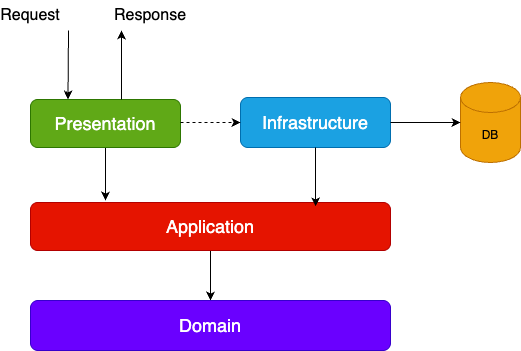

# Clean Architecture

**Clean Architecture** is a software design philosophy introduced by Robert C. Martin (Uncle Bob) that emphasizes separation of concerns, maintainability, and testability. It structures systems into distinct layers, ensuring that business logic remains independent from frameworks, user interfaces, databases, and external agencies.

---

## Key Principles

- **Separation of Concerns:** Each layer has a clear responsibility, reducing coupling and increasing clarity.
- **Independence:** Business logic (core) is isolated from external elements like frameworks, UI, or databases. This allows for easier adaptation to technology changes.
- **Testability:** Core logic can be tested independently of external systems.
- **Maintainability:** Changes in one layer have minimal impact on others, reducing the risk of errors and simplifying modifications.
- **Scalability & Flexibility:** Modular design supports scaling and easy integration of new technologies or requirements.

---

## Layered Structure

Clean Architecture typically organizes code into concentric layers, each with a specific role:

| Layer                    | Responsibility                                                                                |
| ------------------------ | --------------------------------------------------------------------------------------------- |
| **Entities (Domain)**    | Core business rules and enterprise logic. Independent of any technology or application logic. |
| **Use Cases**            | Application-specific business rules. Orchestrates entities to fulfill business requirements.  |
| **Interface Adapters**   | Converts data between the use cases and external agents (UI, database, web, etc.).            |
| **Frameworks & Drivers** | External agents like databases, web frameworks, UI, and third-party libraries.                |

- **Dependency Rule:** Code dependencies can only point inwards. Outer layers depend on inner layers, never vice versa.

---

## SOLID Principles in Clean Architecture

Clean Architecture incorporates SOLID principles for robust component design:

1. **Single Responsibility Principle (SRP):** Each component has one reason to change.
2. **Open-Closed Principle (OCP):** Components are open for extension but closed for modification.
3. **Liskov Substitution Principle (LSP):** Subtypes must be substitutable for their base types.
4. **Interface Segregation Principle (ISP):** Prefer many specific interfaces over a single general-purpose interface.
5. **Dependency Inversion Principle (DIP):** Depend on abstractions, not concretions.

---

## Benefits

- **Maintainability:** Easier to understand, modify, and extend.
- **Testability:** Business logic is easily testable in isolation.
- **Adaptability:** Technology and UI changes do not affect core logic.
- **Reusability:** Core components can be reused across different projects or platforms.

---

## Layer Diagram

In this project:

| Use Clean Architecture When...                 | Avoid Clean Architecture When...                |
| ---------------------------------------------- | ----------------------------------------------- |
| Building complex, long-lived systems           | Project is small or simple                      |
| Domain/business logic is central and complex   | Working under tight deadlines                   |
| Testability and maintainability are priorities | Team lacks experience with Clean Architecture   |
| Requirements are likely to evolve              | Requirements are unclear or change rapidly      |
| Practicing Domain-Driven Design (DDD)          | Risk of overengineering outweighs benefits      |
| Large teams/multiple developers involved       | Limited resources or need for rapid prototyping |
