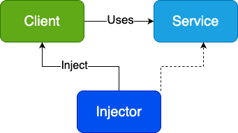

# Dependency Injection

## **What is Dependency Injection?**

Dependency Injection (DI) is a design pattern and programming technique in which an object or function receives its required dependencies from external sources rather than creating them internally This approach separates the construction of dependencies from their usage, promoting loose coupling, flexibility, and easier testing.

---

## **When to Use Dependency Injection**

- **Complex Applications:** Where components have multiple dependencies and the system benefits from modularity and flexibility.
- **Unit Testing:** When you need to easily substitute real dependencies with mocks or stubs for isolated testing.
- **Frequent Changes:** In projects where dependencies or implementations may change often, requiring minimal impact on dependent code.
- **Large Teams/Projects:** To enable parallel development, as teams can work on components and their dependencies independently.
- **Configuration Flexibility:** When runtime configuration or swapping of implementations is needed.

---

## **When Not to Use Dependency Injection**

- **Small or Simple Projects:** Where the overhead of DI adds unnecessary complexity and the benefits are minimal.
- **Few or No Dependencies:** If classes rarely depend on other services or objects, DI may not provide significant value.
- **Performance-Critical Code:** Where even minimal runtime overhead or indirection is unacceptable.
- **Lack of Experience:** If the team is unfamiliar with DI, the learning curve may slow down development and introduce errors.

---

## **Benefits of Dependency Injection**

- **Loose Coupling:** Components depend on abstractions, not concrete implementations, making code more maintainable and flexible.
- **Improved Testability:** Dependencies can be easily mocked or replaced for unit and integration testing.
- **Reusability and Modularity:** Components are self-contained and reusable in different contexts.
- **Easier Maintenance:** Changes to dependencies don’t require changes in dependent classes, reducing the risk of bugs.
- **Runtime Flexibility:** Dependencies can be configured or swapped at runtime, supporting different environments or requirements.
- **Concurrent Development:** Teams can develop components and their dependencies in parallel.

---

## **Drawbacks of Dependency Injection**

- **Added Complexity:** Managing dependencies and their lifecycles can make code harder to understand, especially for newcomers.
- **Learning Curve:** Developers need to understand DI principles and frameworks, which can slow initial development.
- **Performance Overhead:** Dynamic resolution of dependencies may introduce slight runtime costs.
- **Potential for Runtime Errors:** Misconfigured or missing dependencies can cause failures that are harder to debug.
- **Overhead in Small Projects:** For simple applications, DI may add unnecessary boilerplate.

---

## **How Dependency Injection Differs from Inversion of Control and Dependency Inversion**

| Aspect     | Dependency Injection (DI)                                    | Inversion of Control (IoC)                                 | Dependency Inversion Principle (DIP)                                          |
| ---------- | ------------------------------------------------------------ | ---------------------------------------------------------- | ----------------------------------------------------------------------------- |
| What it is | A technique for providing dependencies to objects externally | A broad design principle where control flow is inverted    | A SOLID principle: high-level modules depend on abstractions, not concretions |
| Purpose    | Decouples object creation from usage                         | Decouples execution and object management from application | Encourages code to depend on interfaces/abstractions                          |
| Relation   | A specific way to implement IoC                              | General concept; DI is one way to achieve it               | Guides DI usage; DI helps enforce DIP                                         |
| Example    | Injecting a logger into a service via constructor            | Framework creates and manages controllers in MVC           | Service depends on an ILogger, not a Logger                                   |

**Summary:**

- **Inversion of Control (IoC):** A broad concept where the framework, not the application, controls program flow and object creation.
- **Dependency Injection (DI):** A concrete implementation of IoC where dependencies are provided externally.
- **Dependency Inversion Principle (DIP):** A design guideline stating that high-level modules should depend on abstractions, not concrete implementations. DI is a practical way to enforce DIP.

---

## **Conclusion**

Dependency Injection is a powerful pattern for building flexible, maintainable, and testable software. It is best suited for complex, modular systems but can introduce unnecessary complexity in small or simple projects. DI is a specific implementation of Inversion of Control and a practical way to adhere to the Dependency Inversion Principle, but each concept serves a distinct role in software architecture.
