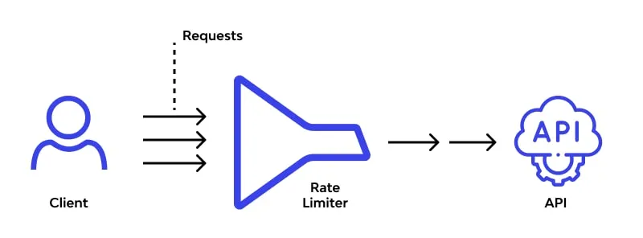

# Rate Limiting

## **What is Rate Limiting?**

Rate limiting is a technique used to control the number of requests or actions a user, client, or service can perform within a specified time frame. By setting a cap on how often someone can repeat an action, rate limiting helps prevent abuse, ensures fair usage, protects system resources, and maintains overall service stability.

Commonly applied to APIs, web servers, and network resources, rate limiting is essential for defending against denial-of-service (DoS) attacks, brute-force login attempts, and other forms of resource abuse[.

---

## **When to Use Rate Limiting**

- **APIs:** To prevent a single user or client from overwhelming the service or monopolizing resources.
- **Web Servers:** To defend against DoS/DDoS attacks and ensure availability for all users.
- **Login Systems:** To block brute-force attacks by limiting the number of login attempts per user or IP.
- **Cost Control:** When third-party services charge per request, rate limiting prevents unexpected cost overruns.
- **Fair Usage:** To ensure all users have equitable access to shared resources.
- **System Stability:** During high-traffic events (e.g., product launches, ticket sales) to avoid crashes or slowdowns.

---

## **When Not to Use Rate Limiting**

- **Internal, Trusted Systems:** Where all clients are controlled and trusted, and there is no risk of abuse.
- **Low-Traffic Applications:** Where the risk of overload or abuse is negligible.
- **Critical Operations:** Where blocking or delaying requests could cause harm or violate service-level agreements (SLAs); alternative controls may be preferable.

---

## **Benefits**

- **Protects Against Abuse:** Defends systems from malicious attacks and accidental overuse.
- **Ensures Fair Resource Allocation:** Prevents any single user or client from monopolizing resources.
- **Maintains System Stability:** Reduces risk of crashes and performance degradation during traffic spikes.
- **Cost Management:** Prevents excessive usage that could result in high operational costs, especially with third-party APIs.
- **Improves Security:** Helps block brute-force, credential stuffing, and scraping attacks.

---

## **Drawbacks**

- **Potential for False Positives:** Legitimate users may be blocked or throttled if limits are too strict.
- **User Frustration:** Poorly communicated or overly aggressive limits can degrade user experience.
- **Implementation Complexity:** Requires careful tuning and monitoring to balance protection and usability.
- **Bypass Risk:** Sophisticated attackers may use distributed sources (e.g., botnets) to circumvent simple rate limits.

---

## **Summary Table**

| Aspect           | Rate Limiting                                                       |
| ---------------- | ------------------------------------------------------------------- |
| Purpose          | Control request rate, prevent abuse, ensure fair usage              |
| Common Use Cases | APIs, web servers, login endpoints, cost control                    |
| Benefits         | System stability, security, fair allocation, cost management        |
| Drawbacks        | False positives, user frustration, tuning complexity, bypass risk   |
| When to Use      | Public APIs, shared resources, high-traffic or attack-prone systems |
| When Not to Use  | Trusted/internal systems, low-traffic apps, critical operations     |

---

## **Conclusion**

Rate limiting is a foundational technique for protecting modern web services and APIs. When applied thoughtfully, it ensures system reliability, security, and fairness. However, it must be carefully configured to avoid blocking legitimate users and to adapt to evolving usage patterns and attack strategies.

**References:**
https://geekpaul.medium.com/understanding-rate-limiting-an-essential-tool-for-system-stability-80b344056504
