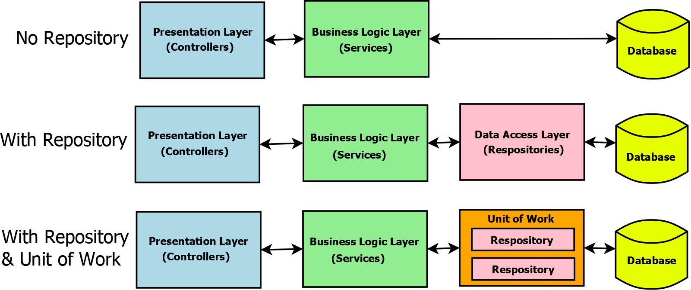

# Repository Pattern Explained

## **What is the Repository Pattern?**

The **Repository Pattern** is a design pattern that acts as a mediator between the domain (business logic) and the data mapping layers of an application. It abstracts and centralizes data access logic, providing a collection-like interface for accessing domain objects. This separation allows business logic to interact with data without needing to know the details of how or where that data is stored, whether it's a database, API, or another persistence mechanism.

**Key Components:**

- **Repository Interface:** Defines standard CRUD operations (Create, Read, Update, Delete) and other data access methods.
- **Concrete Repository Implementation:** Implements the interface, handling the actual data access.
- **Domain Entities:** Business objects that encapsulate both data and behavior.
- **Data Source:** The underlying storage (database, API, etc.) that the repository interacts with.

---

## **When to Use the Repository Pattern**

- When you need to **separate business logic from data access logic** for better maintainability and testability.
- In **medium to large applications** where data access logic is complex or repeated in multiple places.
- When you want to **centralize and standardize data access**, reducing code duplication and programming errors.
- If you anticipate the need to **swap or support multiple data sources** (e.g., switching from SQL to NoSQL) with minimal impact on business logic.
- When building applications using **Domain-Driven Design (DDD)** principles.

---

## **When Not to Use the Repository Pattern**

- In **simple or small applications** where direct data access does not introduce significant complexity.
- When the **overhead of abstraction outweighs the benefits**, such as for straightforward CRUD operations with minimal business logic.
- If your application is unlikely to change data sources or doesn't need to abstract data access for testing or maintainability.

---

## **Benefits of the Repository Pattern**

- **Separation of Concerns:** Keeps business logic and data access logic separate, making code easier to maintain and test.
- **Centralized Data Access:** Reduces code duplication and programming errors by managing all data access in one place.
- **Improved Testability:** Business logic can be tested independently of the data access layer by mocking repositories.
- **Flexibility:** Makes it easier to switch or support multiple data sources without affecting business logic.
- **Consistency:** Standardizes data access methods across the application.

---

## **Drawbacks of the Repository Pattern**

- **Added Complexity:** Introduces additional layers and interfaces, which may be unnecessary for simple applications.
- **Potential Over-Engineering:** Can be overkill for small projects or simple data access needs.
- **Maintenance Overhead:** Requires maintaining extra code (interfaces, implementations), which can slow down development if not justified by application complexity.

---

## **Repository Pattern at a Glance**

| Aspect                 | Repository Pattern                                | Direct Data Access (No Pattern)        |
| ---------------------- | ------------------------------------------------- | -------------------------------------- |
| Data Access Location   | Centralized, via repository interfaces            | Scattered throughout application       |
| Separation of Concerns | Strong: business logic & data access are separate | Weak: often mixed together             |
| Testability            | High: easy to mock repositories                   | Low: hard to isolate data access       |
| Flexibility            | High: easy to swap data sources                   | Low: tightly coupled to storage        |
| Complexity             | Higher: more layers and interfaces                | Lower: straightforward but less robust |

---

## **Summary**

The Repository Pattern is a powerful tool for abstracting and centralizing data access logic, promoting maintainability, testability, and flexibility in medium to large or complex applications. However, it introduces extra complexity and may not be necessary for simple projects with minimal data access needs. Use it when your application will benefit from clean separation of concerns, easier testing, and adaptability to changing data sources.

**References:**  
https://procodeguide.com/programming/repository-pattern-in-aspnet-core/  
https://learn.microsoft.com/en-us/dotnet/architecture/microservices/microservice-ddd-cqrs-patterns/infrastructure-persistence-layer-design
