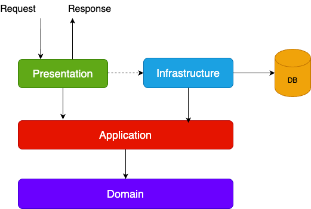

# Product Management - Clean Architecture Demo

A .NET implementation of Clean Architecture principles with CQRS pattern using MediatR.

## 📦 Solution Structure

ProductManagement/
├── ProductManagement.Core/ # Domain Layer
├── ProductManagement.Application/ # Application Layer (CQRS)
├── ProductManagement.Infrastructure/# Infrastructure Layer
└── ProductManagement.API/ # Presentation Layer

## 🛠️ Setup Guide

### Prerequisites

- .NET SDK 6+
- VS Code/Visual Studio 2022
- SQL Server (optional for development)

### Installation

1. Create solution
   dotnet new sln --name ProductManagement

2. Create projects
   dotnet new classlib -n ProductManagement.Core
   dotnet new classlib -n ProductManagement.Application
   dotnet new classlib -n ProductManagement.Infrastructure
   dotnet new webapi -n ProductManagement.API

3. Add to solution
   dotnet sln add ProductManagement.Core/ProductManagement.Core.csproj
   dotnet sln add ProductManagement.Application/ProductManagement.Application.csproj
   dotnet sln add ProductManagement.Infrastructure/ProductManagement.Infrastructure.csproj
   dotnet sln add ProductManagement.API/ProductManagement.API.csproj

4. Add project references
   dotnet add ProductManagement.Application reference ProductManagement.Core
   dotnet add ProductManagement.Infrastructure reference ProductManagement.Core
   dotnet add ProductManagement.API reference ProductManagement.Application
   dotnet add ProductManagement.API reference ProductManagement.Infrastructure

### 📦 NuGet Packages

| Layer              | Packages                                                                                                                      |
| ------------------ | ----------------------------------------------------------------------------------------------------------------------------- |
| **Infrastructure** | `Microsoft.EntityFrameworkCore`, `Microsoft.EntityFrameworkCore.SqlServer`, `Microsoft.EntityFrameworkCore.InMemory`, `Polly` |
| **Application**    | `MediatR`, `MediatR.Extensions.Microsoft.DependencyInjection`, `Microsoft.EntityFrameworkCore.Sqlite`                         |

## 🧩 Architecture Overview

### Key Components

- **Domain Layer**: Entities, Value Objects, Domain Events
- **Application Layer**: CQRS Handlers, DTOs, Interfaces
- **Infrastructure Layer**: EF Core, Repositories, External Services
- **Presentation Layer**: API Controllers, Middleware

## 🚀 Getting Started

1. Clone repository
2. Run `dotnet restore`
3. Configure connection strings in `appsettings.json`
4. Apply migrations (when implemented)

## 🔗 Architecture Pattern and Styles used

1. [Clean Architecture](Assets/docs/clean_architecture.md)
     
   In this project:  
   
2. CQRS
3. Repository
4. Dependency Injection
5. Retry
6. Circuit Breaker
7. Rate Limiter

## 🧪 Testing Notes

Configure InMemory database for unit testing:
services.AddDbContext<AppDbContext>(options => options.UseInMemoryDatabase("TestDB"));

## 📚 Learning Resources

- [Clean Architecture by Robert Martin](https://blog.cleancoder.com/uncle-bob/2012/08/13/the-clean-architecture.html)
- [MediatR Wiki](https://github.com/jbogard/MediatR/wiki)
- [EF Core Documentation](https://docs.microsoft.com/en-us/ef/core/)
